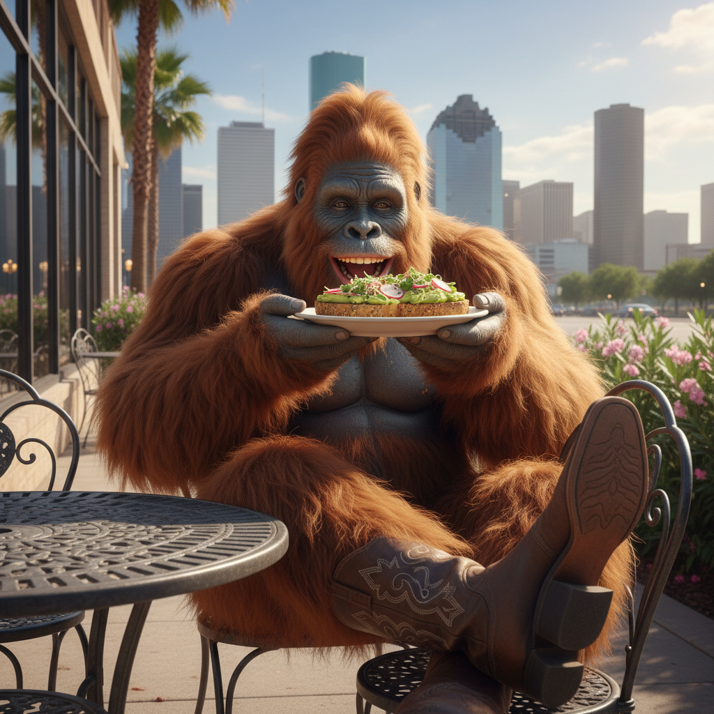

<!-- Bigfoot Avo Toast Houston — A unique image asset featuring a creative mashup of Bigfoot, avocado toast, and Houston culture. -->

# bigfoot-avo-toast-houston-1772998195620

A creative image repository featuring a unique mashup concept: **Bigfoot × Avocado Toast × Houston**. This repo hosts a standalone image asset combining these eclectic themes into one piece.

---

## 🖼️ Preview



---

## 📁 Project Structure

| File | Description |
|------|-------------|
| `bigfoot-avo-toast-houston.png` | The main image asset — a creative visual combining Bigfoot, avocado toast, and Houston imagery |
| `README.md` | This documentation file |

---

## 📖 About

This repository contains a single creative image asset that blends three seemingly unrelated concepts:

- **Bigfoot** — the legendary cryptid of North American folklore
- **Avocado Toast** — the iconic modern brunch staple
- **Houston** — the vibrant Texas metropolis

No code, no dependencies — just a fun, standalone image resource.

---

## 🚀 Usage

To use this image in your own project:

1. **Clone the repository:**

   ```bash
   git clone https://github.com/farmrecipes67/bigfoot-avo-toast-houston-1772998195620.git
   ```

2. **Or download the image directly:**

   ```bash
   curl -O https://raw.githubusercontent.com/farmrecipes67/bigfoot-avo-toast-houston-1772998195620/main/bigfoot-avo-toast-houston.png
   ```

3. **Reference it in HTML or Markdown:**

   ```markdown
   
   ```

---

## 📄 License

No license has been specified for this repository. Please contact the repository owner for usage permissions.

---

## 🔗 Links

- **Repository:** [github.com/farmrecipes67/bigfoot-avo-toast-houston-1772998195620](https://github.com/farmrecipes67/bigfoot-avo-toast-houston-1772998195620)

---

<sub>*This README was auto-generated. Last updated: 2026-03-08.*</sub>